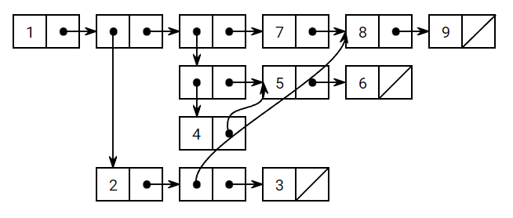

# box-and-pointer
HTML WebElement for box and pointer diagrams

[Click here for a quick start tutorial.](https://github.com/TheUnlocked/box-and-pointer/wiki/Quick-Start)

## Sample

```html
<!DOCTYPE html>
<html>
<head>
    <script src="https://cdnjs.cloudflare.com/ajax/libs/jsPlumb/2.11.2/js/jsplumb.min.js"></script>
    <link id="box-and-pointer-style" rel="stylesheet" href="./box-and-pointer/box-and-pointer.css" />
    <script src="./box-and-pointer/box-and-pointer.js"></script>
</head>
<body>
    <box-and-pointer>
        <list origin explicit-tail>
            1
            <list> 2 <box ref="8"></box> 3 </list>
            <pair>
                <pair> 4 <box ref="5"></box> </pair>
                <list name="5"> 5 6 </list>
            </pair>
            7
            <box ref="8"></box>
        </list>
        <list name="8"> 8 9 </list>
    </box-and-pointer>
</body>
</html>
```


## Credit
* Pointers rendered using [jsPlumb](https://github.com/jsplumb/jsplumb).
* Visual design algorithm based off of the box-and-pointer diagrams at [scheme.cs61a.org](https://scheme.cs61a.org/).
* Uses [html-parsed-element](https://github.com/WebReflection/html-parsed-element) to render only after the internal HTML node structure has been built.
* Built with [TypeScript](http://typescriptlang.org).
* [Webpack](https://webpack.js.org) for making me not need to deal with the nightmare that is CORS with ES6 modules
